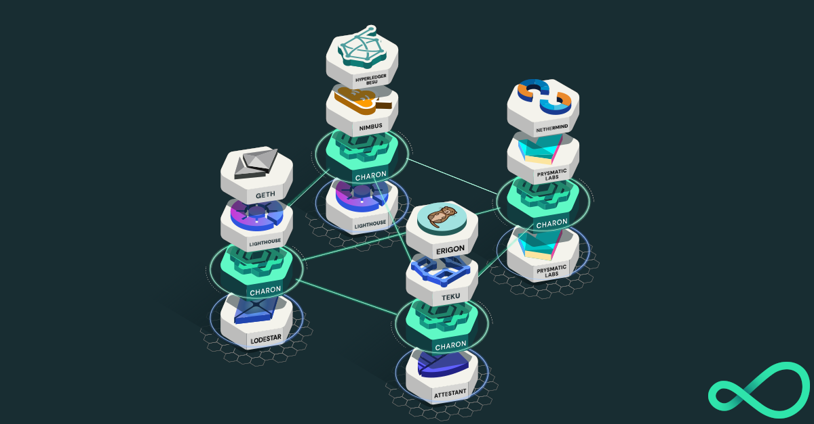

<h1 align="center">Charon Клієнт проміжного програмного забезпечення розподіленого валідатора client</h1>

Ця репозиторія містить вихідний код розподіленого клієнта валідатора _Charon_ (вимовляється як "харон") - HTTP-клієнта проміжного програмного забезпечення для стейкінга Ethereum, який дозволяє безпечно запускати один валідатор на групі незалежних вузлів.

Charon супроводжується веб-додатком під назвою [Distributed Validator Launchpad](https://goerli.launchpad.obol.tech/) для розподіленого створення ключів валідаторів.

Charon використовується стейкерами для розподілу відповідальності за запуск валідаторів Ethereum між різними екземплярами і клієнтськими реалізаціями.

###### Розподілений кластер валідаторів, який використовує клієнт Charon для хеджування ризиків відмов клієнта та обладнання

## Початок роботи

Найпростіший спосіб протестувати Charon - це за допомогою [charon-distributed-validator-cluster](https://github.com/ObolNetwork/charon-distributed-validator-cluster) репозиторій який містить налаштування docker compose для запуску повного кластера charon на вашому локальному комп'ютері.
## Документація

Веб-сайт [Obol Docs] (https://docs.obol.tech/) - найкраще місце для початку роботи.
Важливими розділами є [вступ] (https://docs.obol.tech/docs/intro),
[ключові поняття] (https://docs.obol.tech/docs/int/key-concepts) та [charon] (https://docs.obol.tech/docs/dv/introducing-charon).

Детальна документація по цьому репо знаходиться в папці [docs](docs):

- [Конфігурація](docs/configuration.md): Налаштування вузла charon
- [Архітектура](docs/architecture.md): Огляд архітектури кластерів та вузлів charon
- [Структура проекту](docs/structure.md): Структура теки проекту
- [Модель розгалужень та релізів](docs/branching.md): Модель розгалуження та релізів у Git'і
- [Настанови щодо переходу](docs/goguidelines.md): Настанови та принципи, що стосуються розробки на основі go
- [Внесок](docs/contributing.md): Як зробити внесок у charon; githooks, шаблони PR тощо.

Завжди є [charon godocs](https://pkg.go.dev/github.com/obolnetwork/charon) для документації з вихідного коду.

## Підтримувані клієнти рівня консенсусу

Charon інтегрується в стек консенсусу Ethereum в якості проміжного програмного забезпечення між клієнтом валідатора
і вузлом-маяком через офіційний [Eth Beacon Node REST API] (https://ethereum.github.io/beacon-APIs/#/).
Charon підтримує будь-який висхідний вузол-маяк, який обслуговує Beacon API.
Charon прагне підтримувати будь-який наступний автономний клієнт валідатора, який використовує Beacon API.

| Клієнт                                            | Маяковий вузол| Клієнт валідатора | Примітки                              |
| -------------------------------------------------- | :---------: | :--------------: |-----------------------------------------|
| [Teku](https://github.com/ConsenSys/teku)          |     ✅      |        ✅        | Повністю підтримується                  |
| [Lighthouse](https://github.com/sigp/lighthouse)   |     ✅      |        ✅        | Повністю підтримується                  |
| [Lodestar](https://github.com/ChainSafe/lodestar)  |     ✅      |       \*️⃣        | Проблема сумісності з DVT               |
| [Vouch](https://github.com/attestantio/vouch)      |     \*️⃣     |        ✅        | Надається тільки клієнт валідатора      |
| [Prysm](https://github.com/prysmaticlabs/prysm)    |     ✅      |        🛑        | Клієнту валідатора потрібен gRPC API    |
| [Nimbus](https://github.com/status-im/nimbus-eth2) |     ✅      |        ✅        |Незабаром буде підтримуватися |

## Статус проекту

Мережа  Obol  ще тільки починає свою діяльність і знаходиться в стадії активного розвитку.
Ми рухаємося швидко, тому регулярно заглядайте до нас, щоб відслідковувати прогрес.

Charon є розподіленим валідатором, тому його основним обов'язком є виконання обов'язків валідації.
У наступній таблиці показано, які клієнти створили певні обов'язки у загальнодоступній тестовій мережі, а які все ще перебувають на стадії розробки (🚧 )

| Duty \ Client                        |                      Teku                      |                    Lighthouse                    | Lodestar | Nimbus | Vouch | Prysm |
|--------------------------------------|:----------------------------------------------:|:------------------------------------------------:|:--------:|:------:|:-----:|:-----:|
| _Attestation_                        |                       ✅                        |                        ✅                         |    🚧    |   🚧   |  ✅   |  🚧   |
| _Attestation Aggregation_            |                       🚧                       |                        🚧                        |    🚧    |   🚧   |  🚧   |  🚧   |
| _Block Proposal_                     |                       ✅                        |                        ✅                         |    🚧    |   🚧   |  🚧   |  🚧   |
| _Blinded Block Proposal (mev-boost)_ | [✅](https://ropsten.beaconcha.in/block/555067) | [✅](https://ropsten.etherscan.io/block/12822070) |    🚧    |   🚧   |  🚧   |  🚧   |
| _Sync Committee Message_             |                       ✅                        |                        ✅                         |    🚧    |   🚧   |  🚧   |  🚧   |
| _Sync Committee Contribution_        |                       🚧                       |                        🚧                        |    🚧    |   🚧   |  🚧   |  🚧   |
